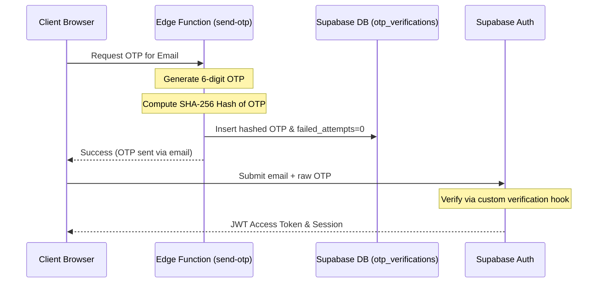

# Swaptics Application Features Guide

This document describes the key functional features of **Swaptics**, detailing user and admin interfaces, backend integrations, and workflows.

---

## 1. Authentication (OTP & Auto-Profile Flow)

Swaptics uses a secure passwordless **One-Time Password (OTP)** authentication flow:

### Key Security Implementations:
1. **Hashed Verification Storage**: The database table `otp_verifications` never records plaintext OTPs. Plaintext codes generated in Deno runtime are hashed using SHA-256 before insertion.
2. **Brute-Force Lockout**: Every failed verification attempt increments a `failed_attempts` counter in the database. If this counter crosses the max limit, the code is immediately invalidated.
3. **Auto-Profile Generation**: On successful sign-up, a PostgreSQL trigger (`on_auth_user_created`) automatically copies data from `auth.users` metadata and constructs a corresponding public row in `profiles`, setting a default `'user'` role.

---

## 2. Hyperlocal Marketplace

The main commercial marketplace enables swapping and selling beauty items:

### Listing Products (`/sell`)
- Users upload images directly to the public Supabase bucket `product-images`.
- Metadata is specified: Brand, Name, Category, Expiry date, and Condition.
- **MRP Savings Metric**: Sellers input both the `original_price` (MRP) and the `selling_price`. The application computes the difference and renders a dynamic green savings badge:
  $$\text{Savings Percentage} = \text{round}\left( \frac{\text{original\_price} - \text{selling\_price}}{\text{original\_price}} \times 100 \right)$$
  This renders as `X% saved` on `ProductCard` and `ProductDetail` components.

### Browse & Search (`/browse`)
- Provides filtering by search text query (checks brand and name fields), category, condition, area location, and price ranges.
- Real-time location filters query the database based on the seller's `area`.

---

## 3. Real-time In-App Chat

Buyer-seller coordination is handled through real-time text chats:

- **Initialization**: A buyer clicks "Chat with Seller" from a listing page. The app checks if a chat regarding that product already exists between the two users; if not, it inserts a new `chats` row.
- **Message Delivery**: The `Chat.tsx` page subscribes to Supabase Realtime changes (`public.messages` table filter `chat_id = current_id`). Message insertions immediately dispatch to the active UI window without polling.
- **Unread Status**: Tracked dynamically using metadata timestamps.

---

## 4. Trust Score & Seller Ratings

To maintain safety on a hyperlocal meetup platform, Swaptics calculates trust scores:

- **Aggregate Rating**: Buyers rate sellers (1 to 5 stars) post-transaction. Ratings are restricted via RLS triggers: users can only rate another user if they have an active chat history with them, preventing review spam.
- **Trust Score Formula**:
  - Aggregates rating counts and calculates positive feedback percentage (ratings $\ge 4$).
  - Evaluates user badges: `Verified Member` (checked via admin verification status), `Super Seller` (more than 5 successful sales), and `Fast Responder`.

---

## 5. Blog & Dynamic SEO Articles

For organic SEO outreach, Swaptics hosts a dedicated articles blog:

- **ArticleDetail Routing (`/articles/:id`)**: Renders individual articles on dynamic routes, enabling unique URL mapping.
- **Dynamic SEO Head Tag Injection**: The custom React hook `useSEO` dynamically targets document components on render. It injects:
  - Meta description containing the article's custom excerpt.
  - OpenGraph elements (title, cover image, and link url) to ensure rich social previews on platforms like WhatsApp or LinkedIn.
- **Social Sharing**: Dedicated actions built-in to copy URL coordinates or share content to messaging lines.

---

## 6. Admin Control Console (`/cbs-admin`)

Admins possess full management capabilities through a tabbed dashboard:

- **Analytics Dashboard**: Renders platform-wide metrics (total listing counts, registered profiles, open reported lists, feedback submissions).
- **Safe User Deletion**: Deletes users using a custom `delete-user` Edge Function. The function executes under a secure PostgreSQL database definer to delete the auth account, drop the profile, and purge images from storage buckets.
- **Feedback & Reports Review**: Displays submissions, allowing admins to take actions to clear flags or remove illegal items.
- **Articles Editor**: Draft, write, upload images, and publish articles to the blog database.
